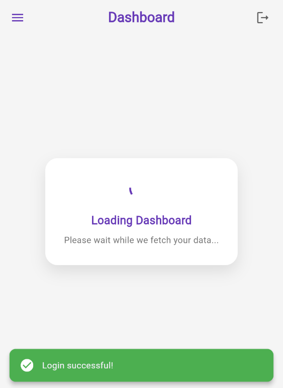
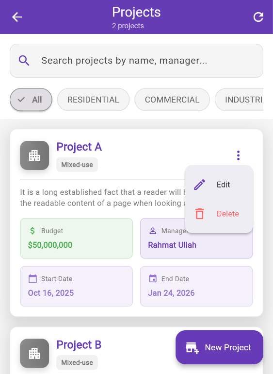
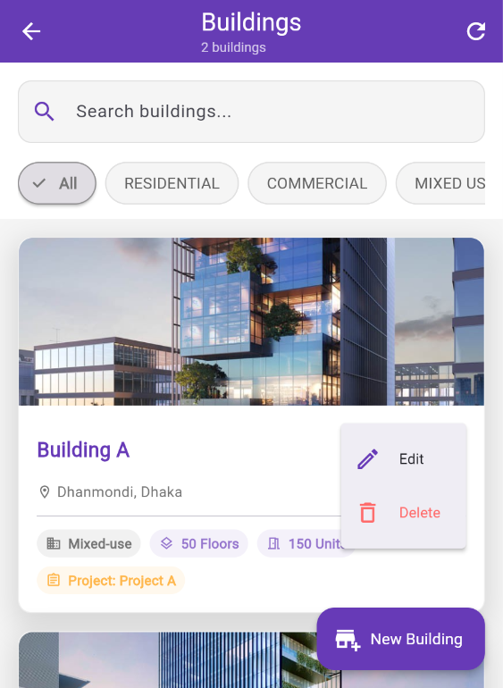
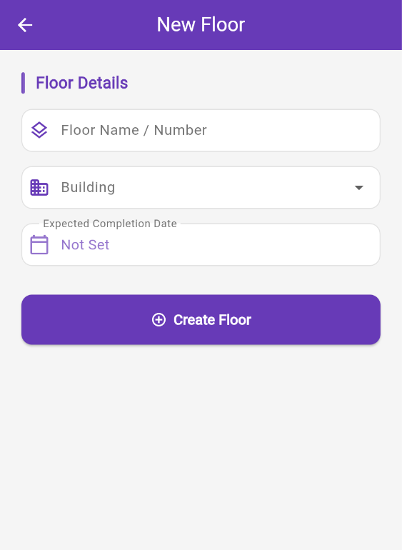
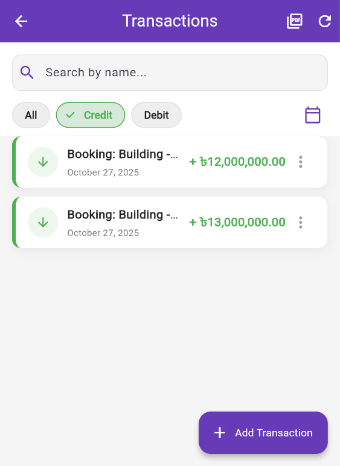
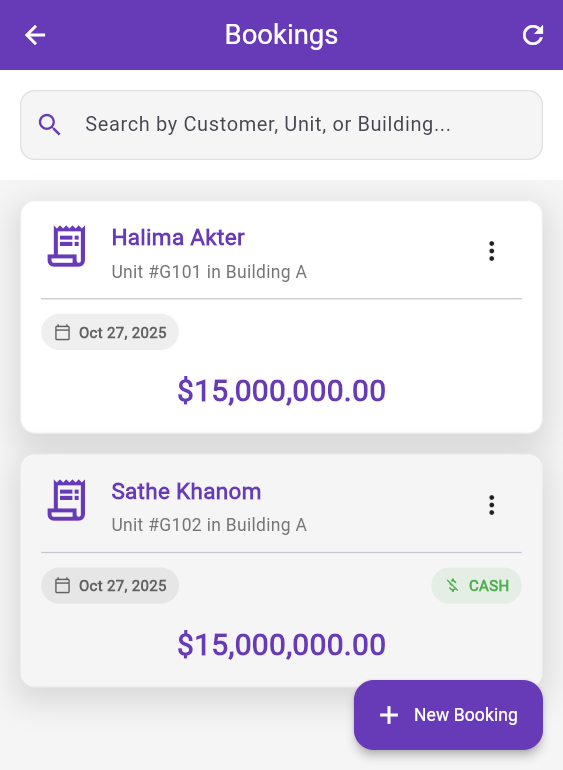

# 🏢 Real Estate Management System

A comprehensive **frontend and backend interface** for managing and visualizing **real estate projects** — including buildings, floors, and construction stages.  
This system provides **interactive modules** for handling **unit bookings, EMI schedules, customer and employee management, attendance tracking, and secure payment transactions** — all wrapped in a **modern, responsive, and user-friendly UI**.

---

## 🧠 Overview

This system streamlines real estate operations by connecting different functional areas such as **projects, customers, employees, and finances** into one intuitive platform.  
Built with **Angular** on the frontend and **Spring Boot** on the backend, it ensures both performance and scalability.

---

## 🚀 Tech Stack

### 🖥️ **Frontend**
- 🅰️ **Angular** — Modern web application framework  
- 🟦 **TypeScript** — Type-safe JavaScript  
- 🧱 **HTML5 / CSS3** — Responsive and accessible UI design  
- 🎨 **Bootstrap / Angular Material** — Elegant, consistent design components  

### ⚙️ **Backend**
- ☕ **Java** — Core backend programming language  
- 🌱 **Spring Boot** — Enterprise-grade backend framework  
- 🔐 **Spring Security** — Authentication and authorization  
- 🗄️ **Spring Data JPA** — ORM and database management  
- 🧩 **MySQL** — Relational database for persistent storage  

---

## ✨ Core Features

### 🏗️ Project & Property Hierarchy Management
- Create and manage **projects**, **buildings**, **floors**, and **stages**  
- Visualize hierarchical property structures  

### 🏘️ Unit Booking Management
- Interactive **unit booking** and **reservation**  
- Real-time **availability tracking**  
- Status updates and detailed booking information  

### 💳 EMI & Payment Processing
- Define and track **EMI schedules**  
- Manage **secure transactions** and payment history  

### 👥 Customer Management
- Maintain a centralized **customer database**  
- Record **interactions, details, and histories**  

### 👔 Employee Management & Attendance
- Manage **employee profiles**, roles, and assignments  
- Integrated **attendance and labour tracking**  

### 📊 Dashboard & Analytics
- Visual data representation and **KPI tracking**  
- Generate **interactive reports**  

### 🔐 Secure Authentication & Authorization
- **Role-based access control** (Admin, Employee, Customer)  
- Encrypted login and session handling  

### 📱 Responsive & User-Friendly Interface
- Fully **mobile-responsive** layout  
- Intuitive and **interactive** navigation  

### 🔍 Advanced Search & Filtering
- **Multi-criteria** search  
- Smart filtering for data accessibility  

---

## 🖼️ Application Previews

### 🏠 Home, Building & Unit Pages

### 🔐 Login

### 📊 Dashboard

### 🏗️ Projects

### 🏢 Buildings

### 🧱 Floors

### 🏗️ Stages

### 👷 Attendance for Stage

### ⚙️ Raw Materials for Stage

### 🏘️ Units

### 🧱 Raw Materials

### 👔 Employees

### 👥 Customers

### 🏘️ Bookings

### 💳 Transactions

---

## 🧾 Disclaimer

> ⚠️ **Copyright Notice**  
> This project and all associated assets (code, images, designs, and documentation) are the **intellectual property of the author**.  
>  
> ❌ **Unauthorized copying, modification, distribution, or commercial use is strictly prohibited.**  
>  
> ✅ You may refer to this project **for educational or portfolio purposes only**, with proper credit given to the original author.  

---

## 📩 Contact

If you’d like to collaborate, discuss, or request permission for usage:  
📧 **Email:** [eiasinprodhanl@gamil.com]  
🌐 **Portfolio:** [eiasinprodhan.github.io](https://eiasinprodhan.github.io)

---

💡 *Crafted with passion for efficiency, design, and innovation in real estate management.*
